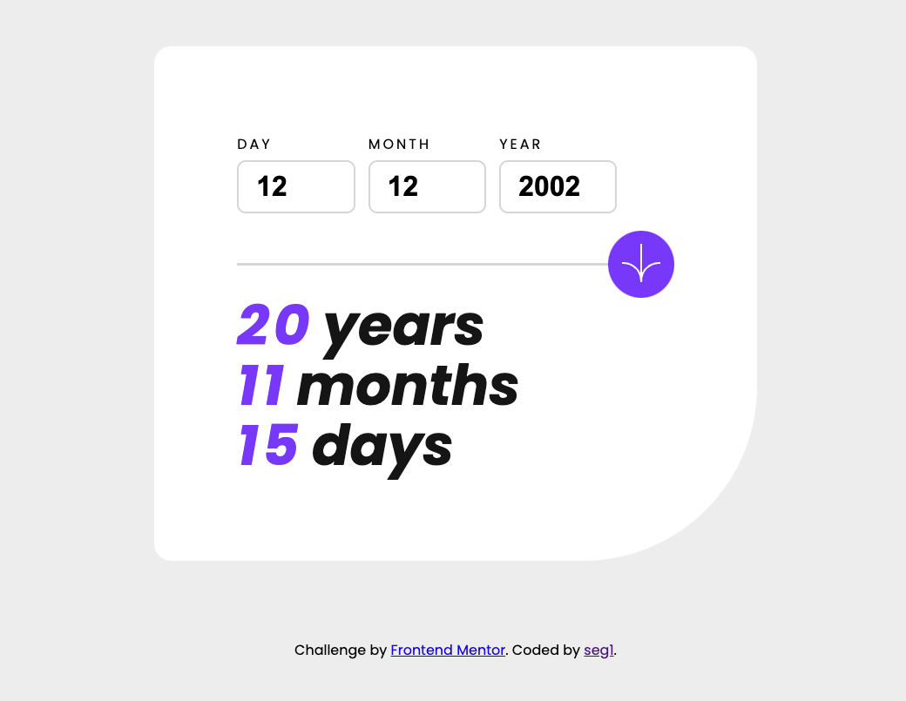

# Frontend Mentor - Age calculator app solution

This is a solution to the [Age calculator app challenge on Frontend Mentor](https://www.frontendmentor.io/challenges/age-calculator-app-dF9DFFpj-Q). Frontend Mentor challenges help you improve your coding skills by building realistic projects. 

## Table of contents

- [Overview](#overview)
  - [The challenge](#the-challenge)
  - [Screenshot](#screenshot)
  - [Links](#links)
- [My process](#my-process)
  - [Built with](#built-with)
  - [What I learned](#what-i-learned)
- [Author](#author)

## Overview

### The challenge

Users should be able to:

- View an age in years, months, and days after submitting a valid date through the form
- Receive validation errors if:
  - Any field is empty when the form is submitted
  - The day number is not between 1-31
  - The month number is not between 1-12
  - The year is in the future
  - The date is invalid e.g. 31/04/1991 (there are 30 days in April)
- View the optimal layout for the interface depending on their device's screen size
- See hover and focus states for all interactive elements on the page

### Screenshot


Here's my final version and solution for this challenge !

### Links

- Solution URL: [Github repository](https://github.com/seg1-exe/age-calculator)
- Live Site URL: [Github pages](https://seg1-exe.github.io/age-calculator/)

## My process

### Built with

- Semantic HTML5 markup
- CSS custom properties
- Flexbox
- Vanilla Javascript

### What I learned

Thanks to this challenge, I've gained a better understanding of how forms work and how they can be processed with javascript.

This piece of css code was totally unknown to me before this project.
```css
input:focus{
    border: 2px solid var(--purple);
    outline: none;
}
```

## Author

- My Bento - [seg1](https://bento.me/seg1)
- Frontend Mentor - [seg1](https://www.frontendmentor.io/profile/Rutabagarre)
- Twitter - [seg1_exe](https://twitter.com/seg1_exe)

